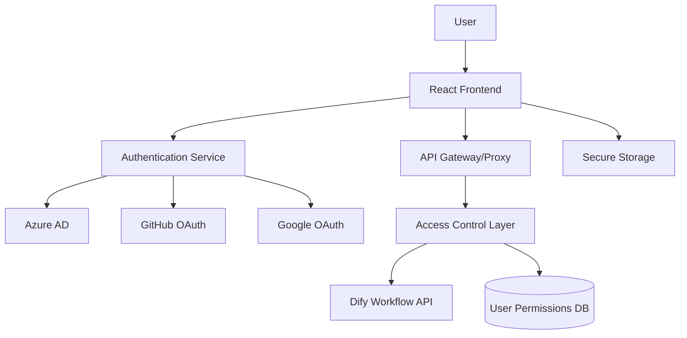

# Design Document

## Overview

DifyワークフローをバックエンドAPIとして活用するReact TypeScriptアプリケーションの設計。OAuth 2.0/OpenID Connectを使用した複数IDプロバイダー認証、属性ベースアクセス制御（ABAC）、そしてDify APIとのセキュアな統合を実現する。

**実装進捗**: 
- ✅ プロジェクト構造とビルド環境（Task 1完了）
- ✅ 認証システム基盤（Task 2.1-2.3完了）
- ✅ OAuth統合とトークン管理（セキュリティ機能含む）
- ✅ アクセス制御システム（Task 3.1-3.2完了）
- ⏳ Dify API統合（Task 4で実装予定）
- ⏳ ルーティングとUI（Task 5-6で実装予定）

## Architecture

### High-Level Architecture



### Technology Stack

- **Frontend Framework**: React 18+ with TypeScript (strict mode)
- **Routing**: React Router v7 with file-based routing (configured but routes not yet implemented)
- **Authentication**: OAuth 2.0/OpenID Connect
- **State Management**: React Context + useReducer
- **HTTP Client**: Fetch API with custom interceptors (Axios not yet implemented)
- **UI Components**: Native HTML/CSS (UI library not yet selected)
- **Build Tool**: Vite 7+ with React plugin
- **Testing**: Jest + React Testing Library + jsdom
- **Code Quality**: ESLint + Prettier + TypeScript strict mode

## Components and Interfaces

### Authentication Layer

#### AuthProvider Component

実装ファイル構造:
- `src/types/auth.ts` - 認証関連の型定義
- `src/context/AuthContext.tsx` - React Context実装（OAuth統合済み、トークン管理統合済み）
- `src/context/authReducer.ts` - 認証状態管理用reducer
- `src/services/oauth.ts` - OAuth サービス（PKCE対応）
- `src/services/tokenManager.ts` - セキュアトークン管理サービス
- `src/services/tokenRefresh.ts` - 自動トークンリフレッシュサービス
- `src/utils/oauth-redirect.ts` - OAuth リダイレクト処理ユーティリティ
- `src/config/oauth-providers.ts` - プロバイダー固有設定
- `src/config/environment.ts` - 環境設定（OAuth設定含む）
- `src/context/index.ts` - エクスポート用インデックス
- `src/services/index.ts` - サービスエクスポート用インデックス
- `src/utils/index.ts` - ユーティリティエクスポート用インデックス
- `src/types/index.ts` - 型定義エクスポート用インデックス
- `docs/oauth-implementation.md` - OAuth実装詳細ドキュメント

```typescript
interface AuthContextType {
  user: User | null;
  isAuthenticated: boolean;
  isLoading: boolean;
  login: (provider: AuthProviderType) => Promise<void>;
  logout: () => Promise<void>;
  refreshToken: () => Promise<void>;
  completeLogin: (sessionData: SessionData) => Promise<void>;
}

interface User {
  id: string;
  email: string;
  name: string;
  provider: AuthProviderType;
  attributes: UserAttributes;
  permissions: Permission[];
}

interface UserAttributes {
  domain: string;
  roles: string[];
  department?: string;
  organization?: string;
}

type AuthProviderType = 'azure' | 'github' | 'google';
```

#### OAuth Configuration

```typescript
interface OAuthConfig {
  azure: {
    clientId: string;
    tenantId: string;
    redirectUri: string;
    scopes: string[];
  };
  github: {
    clientId: string;
    redirectUri: string;
    scopes: string[];
  };
  google: {
    clientId: string;
    redirectUri: string;
    scopes: string[];
  };
}

// Implemented OAuth Service with PKCE support
class OAuthService {
  async getAuthorizationUrl(provider: AuthProviderType): Promise<string>;
  validateCallback(code: string, state: string, provider: AuthProviderType): boolean;
  getCodeVerifier(): string;
  clearOAuthSession(): void;
  getProviderConfig(provider: AuthProviderType): OAuthConfig[AuthProviderType];
}

// OAuth redirect handling utilities
interface OAuthCallbackParams {
  code?: string;
  state?: string;
  error?: string;
  error_description?: string;
  provider: AuthProviderType;
}

// Provider-specific configurations with security features
// - Azure AD: PKCE, tenant-specific auth, User.Read scope
// - GitHub: Standard OAuth 2.0, user:email and read:user scopes
// - Google: PKCE, offline access, OpenID Connect scopes
```

### Access Control Layer

#### User Attribute Service (✅ 実装完了)

```typescript
// User attribute extraction and processing service
interface UserAttributeService {
  extractUserAttributes(rawData: RawUserData, provider: AuthProviderType): User;
  updateUserAttributes(currentUser: User, newRawData: RawUserData): User;
  mergeAttributes(baseAttributes: UserAttributes, newAttributes: Partial<UserAttributes>): UserAttributes;
}

// Provider-specific user data interfaces
interface AzureUserData extends RawUserData {
  userPrincipalName: string;
  displayName: string;
  jobTitle?: string;
  department?: string;
  companyName?: string;
}

interface GitHubUserData extends RawUserData {
  login: string;
  company?: string;
  public_repos: number;
  followers: number;
}

interface GoogleUserData extends RawUserData {
  sub: string;
  given_name?: string;
  family_name?: string;
  hd?: string; // hosted domain for G Suite users
}

// Validation and error handling
class UserAttributeValidationError extends Error {
  constructor(message: string, field: string, provider: AuthProviderType);
}
```

**実装ファイル**:
- `src/services/userAttributeService.ts` - メインサービス実装
- `src/services/__tests__/userAttributeService.test.ts` - 19の包括的テスト
- `src/examples/userAttributeIntegration.ts` - 統合例とアクセス制御デモ
- `src/examples/__tests__/userAttributeIntegration.test.ts` - 11の統合テスト

**主要機能**:
- Azure AD、GitHub、Googleからの属性抽出
- プロバイダー間での属性正規化
- 包括的なデータ検証とエラーハンドリング
- ドメイン抽出とロールベースアクセス制御の基盤

#### Permission System (✅ Task 3.2完了)

```typescript
// Access control service interfaces (実装済み)
interface AccessControlService {
  checkAccess(user: User, resource: string, action: string): AccessResult;
  getAvailableWorkflows(user: User): DifyWorkflow[];
  updateUserPermissions(user: User): User;
  getAvailableServices(user: User): string[];
  canAccessService(user: User, serviceName: string): boolean;
  updateDomainMapping(mapping: DomainServiceMapping): void;
  updateWorkflow(workflow: DifyWorkflow): void;
}

interface AccessResult {
  allowed: boolean;
  reason?: string;
  requiredPermissions?: string[];
  missingConditions?: AccessCondition[];
}

// Domain-based service mapping (実装済み)
interface DomainServiceMapping {
  domain: string;
  allowedServices: string[];
  defaultPermissions: Permission[];
  roleBasedPermissions?: Record<string, Permission[]>;
}

// Access control configuration (実装済み)
interface AccessControlConfig {
  domainMappings: DomainServiceMapping[];
  globalPermissions: Permission[];
  workflows: DifyWorkflow[];
}
```

**実装ファイル**:
- `src/services/accessControlService.ts` - メインサービス実装
- `src/services/__tests__/accessControlService.test.ts` - 34の包括的テスト
- `src/examples/accessControlIntegration.ts` - 統合デモとユースケース
- `src/examples/__tests__/accessControlIntegration.test.ts` - 14の統合テスト

**主要機能**:
- **権限チェック**: リソースとアクションに基づく細かい権限制御
- **条件評価**: equals、contains、matchesオペレーターによる属性ベース制御
- **ドメインマッピング**: メールドメインからサービスへの自動マッピング
- **ロールベース権限**: ユーザーロールに基づく動的権限割り当て
- **ワークフロー制御**: Difyワークフローへのアクセス制御
- **動的更新**: 再認証なしでの権限更新
- **権限統合**: 複数ソースからの権限の重複排除と統合

**セキュリティ機能**:
- ワイルドカード権限サポート（`*`リソース、`*`アクション）
- ネストした属性パスでの条件評価（`attributes.department`など）
- 包括的なエラーハンドリングと理由の提供
- 設定の動的更新とホットリロード

### Dify Integration Layer

#### Dify API Client

```typescript
interface DifyWorkflow {
  id: string;
  name: string;
  description: string;
  inputSchema: JSONSchema;
  outputSchema: JSONSchema;
  requiredPermissions: string[];
}

interface DifyAPIClient {
  getWorkflows(): Promise<DifyWorkflow[]>;
  executeWorkflow(workflowId: string, input: any): Promise<WorkflowResult>;
  getWorkflowStatus(executionId: string): Promise<ExecutionStatus>;
}

interface WorkflowResult {
  executionId: string;
  status: 'pending' | 'running' | 'completed' | 'failed';
  result?: any;
  error?: string;
}
```

### UI Components

#### React Router v7 Configuration

```typescript
// react-router.config.ts
import type { Config } from '@react-router/dev/config';

export default {
  // Enable SPA mode (no server-side rendering)
  ssr: false,
  // Configure the app directory
  appDirectory: 'app',
  // Configure build directory
  buildDirectory: 'dist',
  // Configure public directory
  publicPath: '/',
} satisfies Config;

// vite.config.ts
import { defineConfig } from 'vite';
import { reactRouter } from '@react-router/dev/vite';

export default defineConfig({
  plugins: [reactRouter()],
  server: {
    port: 5173,
    host: true,
  },
  build: {
    target: 'es2022',
    sourcemap: true,
  },
});

// File-based routing structure
// app/root.tsx - Root layout component
// app/entry.client.tsx - Client entry point
// app/entry.server.tsx - Server entry point (for SSR support)
// app/routes.ts - Route configuration
// app/routes/_index.tsx - Dashboard (protected)
// app/routes/login.tsx - Login page
// app/routes/callback.$provider.tsx - OAuth callback
// app/routes/workflows._index.tsx - Workflow list (protected)
// app/routes/workflows.$id.tsx - Workflow execution (protected)

// Route configuration with loaders and actions
interface RouteConfig {
  loader?: (args: LoaderFunctionArgs) => Promise<any>;
  action?: (args: ActionFunctionArgs) => Promise<any>;
  Component: React.ComponentType;
  ErrorBoundary?: React.ComponentType;
}

// Example route with authentication check
export const loader: LoaderFunction = async ({ request }) => {
  const user = await requireAuth(request);
  return { user };
};

// Virtual module type declaration required
declare module 'virtual:react-router/routes' {
  import type { RouteObject } from 'react-router';
  const routes: RouteObject[];
  export default routes;
}
```

## Data Models

### Authentication Models

```typescript
// JWT Token Structure
interface JWTPayload {
  sub: string; // user ID
  email: string;
  name: string;
  provider: string;
  iat: number;
  exp: number;
  permissions: string[];
}

// Session Storage
interface SessionData {
  accessToken: string;
  refreshToken: string;
  expiresAt: number;
  user: User;
}

// Authentication state for useReducer
interface AuthState {
  user: User | null;
  isAuthenticated: boolean;
  isLoading: boolean;
  error: string | null;
}

// Authentication actions for useReducer
type AuthAction =
  | { type: 'LOGIN_START' }
  | { type: 'LOGIN_SUCCESS'; payload: User }
  | { type: 'LOGIN_FAILURE'; payload: string }
  | { type: 'LOGOUT' }
  | { type: 'REFRESH_TOKEN_SUCCESS'; payload: User }
  | { type: 'REFRESH_TOKEN_FAILURE' }
  | { type: 'SET_LOADING'; payload: boolean }
  | { type: 'CLEAR_ERROR' };

// Token Management Services
interface TokenManager {
  storeSession(sessionData: SessionData): void;
  getStoredSession(): SessionData | null;
  isTokenValid(sessionData: SessionData | null): boolean;
  needsRefresh(sessionData: SessionData | null): boolean;
  clearSession(): void;
  getValidAccessToken(): string | null;
  detectSuspiciousActivity(): boolean;
}

interface TokenRefreshService {
  refreshAccessToken(): Promise<SessionData | null>;
  setupAutoRefresh(): void;
  clearAutoRefresh(): void;
  validateAndRefreshSession(): Promise<{ isValid: boolean; user: User | null }>;
}
```

### Workflow Models

```typescript
interface WorkflowInput {
  [key: string]: any;
}

interface WorkflowExecution {
  id: string;
  workflowId: string;
  userId: string;
  input: WorkflowInput;
  status: ExecutionStatus;
  createdAt: Date;
  completedAt?: Date;
  result?: any;
  error?: string;
}
```

## Error Handling

### Error Types

```typescript
enum ErrorType {
  AUTHENTICATION_ERROR = 'AUTHENTICATION_ERROR',
  AUTHORIZATION_ERROR = 'AUTHORIZATION_ERROR',
  NETWORK_ERROR = 'NETWORK_ERROR',
  VALIDATION_ERROR = 'VALIDATION_ERROR',
  DIFY_API_ERROR = 'DIFY_API_ERROR',
}

interface AppError {
  type: ErrorType;
  message: string;
  code?: string;
  details?: any;
}
```

### Error Handling Strategy

1. **Authentication Errors**: Redirect to login, clear session
2. **Authorization Errors**: Show access denied page, log security event
3. **Network Errors**: Retry mechanism with exponential backoff
4. **Validation Errors**: Show user-friendly form validation
5. **Dify API Errors**: Display workflow-specific error messages

### Global Error Boundary

```typescript
interface ErrorBoundaryState {
  hasError: boolean;
  error?: AppError;
}

class GlobalErrorBoundary extends Component<Props, ErrorBoundaryState> {
  // Error boundary implementation with logging and user feedback
}
```

## Security Architecture

### Authentication Security

- **OAuth 2.0 PKCE**: Implemented for Azure AD and Google with SHA-256 code challenge method
- **Secure Token Storage**: 
  - SessionStorage for access tokens (cleared on tab close)
  - LocalStorage for refresh tokens (persists across browser sessions)
  - Automatic cleanup and session timeout handling (24-hour maximum)
- **CSRF Protection**: Cryptographically secure state parameter validation in OAuth flow
- **Token Management**: 
  - Automatic token refresh with 5-minute expiration buffer
  - Proactive token renewal to prevent session interruption
  - Suspicious activity detection and session invalidation
  - Complete token cleanup on logout
- **Provider-Specific Security**: 
  - Azure AD: Tenant-specific authentication with proper scope validation
  - GitHub: Standard OAuth 2.0 with secure state validation
  - Google: PKCE with offline access and consent prompt
- **Error Handling**: Comprehensive provider-specific error messages and user-friendly feedback
- **Session Security**:
  - JWT token validation and expiration handling
  - Session restoration on browser restart
  - Automatic logout on token expiration
  - Rate limiting for refresh attempts

### API Security

- **Request Signing**: HMAC signatures for Dify API requests
- **Rate Limiting**: Client-side request throttling
- **Input Validation**: Schema-based validation for all inputs
- **XSS Prevention**: Content Security Policy headers

### Access Control Security

```typescript
interface SecurityPolicy {
  sessionTimeout: number; // minutes
  maxLoginAttempts: number;
  passwordPolicy?: PasswordPolicy;
  ipWhitelist?: string[];
  domainWhitelist: string[];
}
```

## Performance Considerations

### Optimization Strategies

1. **Code Splitting**: Automatic route-based code splitting with React Router v7
2. **Data Loading**: Parallel data loading with route loaders
3. **Caching**: React Query for API response caching and React Router v7 built-in caching
4. **Memoization**: React.memo for expensive components
5. **Bundle Optimization**: Tree shaking and dynamic imports
6. **Prefetching**: Route-based prefetching for improved navigation

### Performance Metrics

- **First Contentful Paint**: < 1.5s
- **Time to Interactive**: < 3s
- **Largest Contentful Paint**: < 2.5s
- **Cumulative Layout Shift**: < 0.1

## Testing Strategy

### Testing Pyramid

1. **Unit Tests (70%)**
   - Component testing with React Testing Library
   - Service layer testing with Jest
   - Utility function testing

2. **Integration Tests (20%)**
   - API integration testing
   - Authentication flow testing
   - Access control testing

3. **End-to-End Tests (10%)**
   - Critical user journeys
   - Cross-browser compatibility
   - Authentication scenarios

### Test Configuration

実装されたテスト設定ファイル:
- `jest.config.js` - Jest設定
- `src/setupTests.ts` - テスト環境セットアップ（ポリフィル、モック）
- `src/config/__mocks__/environment.ts` - 環境設定モック

実装されたテストスイート:
- `src/context/__tests__/AuthContext.test.tsx` - 認証コンテキストテスト（10テスト）
- `src/context/__tests__/authReducer.test.ts` - 認証リデューサーテスト（8テスト）
- `src/services/__tests__/oauth.test.ts` - OAuthサービステスト（19テスト）
- `src/services/__tests__/tokenManager.test.ts` - トークン管理テスト（31テスト）
- `src/services/__tests__/tokenRefresh.test.ts` - トークンリフレッシュテスト（19テスト）
- `src/services/__tests__/tokenIntegration.test.ts` - 統合テスト（4テスト）
- `src/utils/__tests__/oauth-redirect.test.ts` - OAuthリダイレクトテスト（20テスト）
- `src/services/__tests__/userAttributeService.test.ts` - ユーザー属性サービステスト（19テスト）
- `src/examples/__tests__/userAttributeIntegration.test.ts` - 属性統合テスト（11テスト）
- `src/services/__tests__/accessControlService.test.ts` - アクセス制御サービステスト（34テスト）
- `src/examples/__tests__/accessControlIntegration.test.ts` - アクセス制御統合テスト（14テスト）

実装済み設定ファイル:
- `jest.config.js` - Jest設定（TypeScript、jsdom環境）
- `tsconfig.app.json` - アプリケーション用TypeScript設定（strict mode）
- `tsconfig.json` - ベースTypeScript設定
- `tsconfig.node.json` - Node.js用TypeScript設定
- `.eslintrc.json` - ESLint設定（TypeScript、React、Prettier統合）
- `.prettierrc` - Prettier設定
- `vite.config.ts` - Vite設定（React Router v7統合）
- `react-router.config.ts` - React Router v7設定（SPA mode）
- 環境設定ファイル: `.env`, `.env.development`, `.env.production`, `.env.staging`

**テストカバレッジ**: 189テスト（1スキップ）、全て合格
- 新規追加: ユーザー属性サービス（19テスト）+ 統合例（11テスト）= 30テスト追加
- 新規追加: アクセス制御サービス（34テスト）+ 統合例（14テスト）= 48テスト追加

```typescript
// Jest Configuration
interface TestConfig {
  preset: 'ts-jest';
  testEnvironment: 'jsdom';
  setupFilesAfterEnv: ['<rootDir>/src/setupTests.ts'];
  moduleNameMapper: {
    '\\.(css|less|scss|sass)$': 'identity-obj-proxy';
    '\\.(gif|ttf|eot|svg|png)$': 'test-file-stub';
  };
  transform: {
    '^.+\\.(ts|tsx)$': ['ts-jest', {
      tsconfig: {
        jsx: 'react-jsx',
        module: 'commonjs',
        target: 'es2022',
        esModuleInterop: true,
        allowSyntheticDefaultImports: true,
        moduleResolution: 'node',
      },
    }];
  };
  collectCoverageFrom: [
    'src/**/*.{ts,tsx}',
    '!src/**/*.d.ts',
    '!src/main.tsx',
    '!src/vite-env.d.ts',
  ];
  coverageDirectory: 'coverage';
  coverageReporters: ['text', 'lcov', 'html'];
}

// Test Setup Requirements
// - TextEncoder/TextDecoder polyfills for Node.js environment
// - matchMedia mock for browser APIs
// - IntersectionObserver mock for modern web APIs
// - @testing-library/jest-dom for enhanced matchers
```

### Mock Strategies

- **Authentication Mocks**: Mock OAuth providers for testing
- **API Mocks**: MSW (Mock Service Worker) for Dify API
- **Storage Mocks**: LocalStorage and SessionStorage mocks

### Implementation Challenges and Solutions

#### React Router v7 Setup Issues

**Challenge**: React Router v7 requires specific file structure and configuration for file-based routing.

**Solution**:
1. Install `@react-router/dev` and `@react-router/node` packages
2. Create `app/` directory with proper entry points (`entry.client.tsx`, `entry.server.tsx`)
3. Configure `react-router.config.ts` for SPA mode
4. Add virtual module type declarations for `virtual:react-router/routes`
5. Use `reactRouter()` plugin in Vite configuration instead of standard React plugin

#### Jest Configuration for Modern React

**Challenge**: Jest requires specific configuration for TypeScript, JSX, and modern browser APIs.

**Solution**:
1. Use `ts-jest` preset with proper TypeScript configuration
2. Add polyfills for `TextEncoder`/`TextDecoder` in test setup
3. Mock `matchMedia` and `IntersectionObserver` for browser APIs
4. Configure module name mapping for CSS and asset files
5. Set up proper coverage collection excluding entry points

**Resolved Issue**: `import.meta.env` handling in Jest environment has been resolved with proper environment mocking configuration.

#### TypeScript Strict Mode with Vite Environment Variables

**Challenge**: TypeScript strict mode requires bracket notation for `import.meta.env` properties.

**Solution**:
1. Use `env['VITE_VARIABLE_NAME']` instead of `env.VITE_VARIABLE_NAME`
2. Add proper type declarations for environment variables
3. Configure TypeScript with additional strict options for better type safety

#### ESLint Configuration for React Router v7

**Challenge**: React Router v7 route files export both components and functions, conflicting with `react-refresh/only-export-components` rule.

**Solution**:
1. Add ESLint overrides for `app/routes/**/*.tsx` files
2. Disable `react-refresh/only-export-components` rule for route files
3. Use ESLint disable comments for specific route patterns

## Deployment Architecture

### Environment Configuration

```typescript
interface EnvironmentConfig {
  appName: string;
  appVersion: string;
  nodeEnv: string;
  apiBaseUrl: string;
  difyApiUrl: string;
  oauthConfig: {
    azure: {
      clientId: string;
      tenantId: string;
    };
    github: {
      clientId: string;
    };
    google: {
      clientId: string;
    };
    redirectUri: string;
  };
  security: {
    sessionTimeout: number;
    maxLoginAttempts: number;
  };
  features: {
    enableAnalytics: boolean;
    enableDebugMode: boolean;
  };
  logLevel: 'debug' | 'info' | 'warn' | 'error';
}

// 実際の環境変数構造（VITE_プレフィックス必須）
// .env (デフォルト値)
// .env.development (開発環境設定)
// .env.staging (ステージング環境設定) 
// .env.production (本番環境設定)

// Environment Files Structure:
// - .env (default values)
// - .env.development (development overrides)
// - .env.staging (staging configuration)
// - .env.production (production configuration)
// All environment variables must be prefixed with VITE_ for Vite access
```

### TypeScript Configuration

```typescript
// tsconfig.app.json - Application TypeScript configuration
{
  "compilerOptions": {
    "target": "ES2022",
    "lib": ["ES2022", "DOM", "DOM.Iterable"],
    "module": "ESNext",
    "skipLibCheck": true,
    "moduleResolution": "bundler",
    "allowImportingTsExtensions": true,
    "verbatimModuleSyntax": true,
    "moduleDetection": "force",
    "noEmit": true,
    "jsx": "react-jsx",
    
    // Strict mode options
    "strict": true,
    "noUnusedLocals": true,
    "noUnusedParameters": true,
    "noFallthroughCasesInSwitch": true,
    "noUncheckedSideEffectImports": true,
    "erasableSyntaxOnly": true,
    
    // Additional strict mode options
    "exactOptionalPropertyTypes": true,
    "noImplicitReturns": true,
    "noImplicitOverride": true,
    "noPropertyAccessFromIndexSignature": true,
    
    // Module interop
    "esModuleInterop": true,
    "allowSyntheticDefaultImports": true
  }
}
```

### ESLint and Prettier Configuration

```typescript
// .eslintrc.json
{
  "env": {
    "browser": true,
    "es2022": true,
    "node": true
  },
  "extends": [
    "eslint:recommended",
    "@typescript-eslint/recommended",
    "@typescript-eslint/recommended-requiring-type-checking",
    "plugin:react/recommended",
    "plugin:react-hooks/recommended",
    "prettier"
  ],
  "parser": "@typescript-eslint/parser",
  "parserOptions": {
    "ecmaFeatures": {
      "jsx": true
    },
    "ecmaVersion": "latest",
    "sourceType": "module",
    "project": "./tsconfig.json"
  },
  "plugins": [
    "react",
    "react-hooks", 
    "@typescript-eslint",
    "prettier",
    "react-refresh"
  ],
  "rules": {
    "prettier/prettier": "error",
    "react/react-in-jsx-scope": "off",
    "@typescript-eslint/no-unused-vars": "error",
    "@typescript-eslint/explicit-function-return-type": "warn",
    "@typescript-eslint/no-explicit-any": "warn",
    "@typescript-eslint/prefer-const": "error",
    "react-refresh/only-export-components": "warn"
  },
  "overrides": [
    {
      "files": ["app/routes/**/*.tsx", "app/routes/**/*.ts"],
      "rules": {
        "react-refresh/only-export-components": "off"
      }
    }
  ],
  "settings": {
    "react": {
      "version": "detect"
    }
  }
}

// .prettierrc
{
  "semi": true,
  "trailingComma": "es5",
  "singleQuote": true,
  "printWidth": 80,
  "tabWidth": 2,
  "useTabs": false,
  "bracketSpacing": true,
  "arrowParens": "avoid"
}
```

### Build Pipeline

1. **Development**: Hot reload with Vite dev server
2. **Staging**: Production build with source maps
3. **Production**: Optimized build with compression

### Package Scripts

```json
{
  "scripts": {
    "dev": "vite",
    "build": "tsc -b && vite build",
    "lint": "eslint .",
    "lint:fix": "eslint . --fix",
    "format": "prettier --write .",
    "format:check": "prettier --check .",
    "test": "jest",
    "test:watch": "jest --watch",
    "test:coverage": "jest --coverage",
    "preview": "vite preview",
    "type-check": "tsc --noEmit"
  }
}
```

**実装状況**: 全スクリプトが実装済みで正常動作確認済み

### Monitoring and Logging

- **Error Tracking**: Sentry integration (未実装 - Task 10.2で予定)
- **Analytics**: User interaction tracking (未実装 - Task 10.2で予定)
- **Performance Monitoring**: Web Vitals tracking (未実装 - Task 10.1で予定)
- **Security Logging**: Authentication and authorization events (基本実装済み - console.log, 本格実装はTask 7.1で予定)
