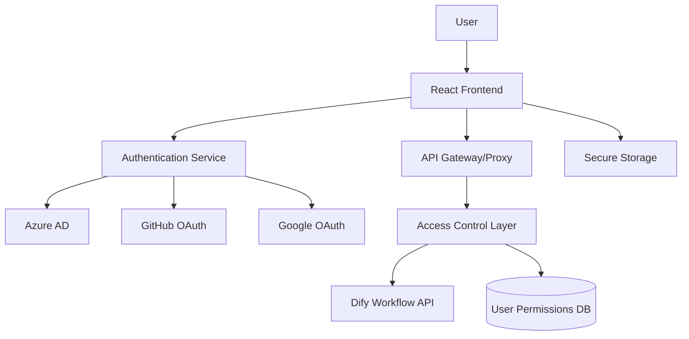

# Design Document

## Overview

DifyワークフローをバックエンドAPIとして活用するReact TypeScriptアプリケーションの設計。OAuth 2.0/OpenID Connectを使用した複数IDプロバイダー認証、属性ベースアクセス制御（ABAC）、そしてDify APIとのセキュアな統合を実現する。

## Architecture

### High-Level Architecture



### Technology Stack

- **Frontend Framework**: React 18+ with TypeScript (strict mode)
- **Routing**: React Router v7 with file-based routing
- **Authentication**: OAuth 2.0/OpenID Connect
- **State Management**: React Context + useReducer
- **HTTP Client**: Axios with interceptors
- **UI Components**: Material-UI or Chakra UI
- **Build Tool**: Vite 7+ with React plugin
- **Testing**: Jest + React Testing Library + jsdom
- **Code Quality**: ESLint + Prettier + TypeScript strict mode

## Components and Interfaces

### Authentication Layer

#### AuthProvider Component

```typescript
interface AuthContextType {
  user: User | null;
  isAuthenticated: boolean;
  isLoading: boolean;
  login: (provider: AuthProvider) => Promise<void>;
  logout: () => Promise<void>;
  refreshToken: () => Promise<void>;
}

interface User {
  id: string;
  email: string;
  name: string;
  provider: 'azure' | 'github' | 'google';
  attributes: UserAttributes;
  permissions: Permission[];
}

interface UserAttributes {
  domain: string;
  roles: string[];
  department?: string;
  organization?: string;
}
```

#### OAuth Configuration

```typescript
interface OAuthConfig {
  azure: {
    clientId: string;
    tenantId: string;
    redirectUri: string;
    scopes: string[];
  };
  github: {
    clientId: string;
    redirectUri: string;
    scopes: string[];
  };
  google: {
    clientId: string;
    redirectUri: string;
    scopes: string[];
  };
}
```

### Access Control Layer

#### Permission System

```typescript
interface Permission {
  resource: string;
  actions: string[];
  conditions?: AccessCondition[];
}

interface AccessCondition {
  attribute: string;
  operator: 'equals' | 'contains' | 'matches';
  value: string | string[];
}

interface AccessControlService {
  checkAccess(user: User, resource: string, action: string): boolean;
  getAvailableWorkflows(user: User): DifyWorkflow[];
  updateUserPermissions(
    userId: string,
    permissions: Permission[]
  ): Promise<void>;
}
```

### Dify Integration Layer

#### Dify API Client

```typescript
interface DifyWorkflow {
  id: string;
  name: string;
  description: string;
  inputSchema: JSONSchema;
  outputSchema: JSONSchema;
  requiredPermissions: string[];
}

interface DifyAPIClient {
  getWorkflows(): Promise<DifyWorkflow[]>;
  executeWorkflow(workflowId: string, input: any): Promise<WorkflowResult>;
  getWorkflowStatus(executionId: string): Promise<ExecutionStatus>;
}

interface WorkflowResult {
  executionId: string;
  status: 'pending' | 'running' | 'completed' | 'failed';
  result?: any;
  error?: string;
}
```

### UI Components

#### React Router v7 Configuration

```typescript
// react-router.config.ts
import type { Config } from '@react-router/dev/config';

export default {
  ssr: false, // SPA mode for client-side only application
  appDirectory: 'app',
  buildDirectory: 'dist',
  publicPath: '/',
} satisfies Config;

// vite.config.ts
import { defineConfig } from 'vite';
import { reactRouter } from '@react-router/dev/vite';

export default defineConfig({
  plugins: [reactRouter()],
  server: {
    port: 5173,
    host: true,
  },
  build: {
    target: 'es2022',
    sourcemap: true,
  },
});

// File-based routing structure
// app/root.tsx - Root layout component
// app/entry.client.tsx - Client entry point
// app/entry.server.tsx - Server entry point (for SSR support)
// app/routes.ts - Route configuration
// app/routes/_index.tsx - Dashboard (protected)
// app/routes/login.tsx - Login page
// app/routes/callback.$provider.tsx - OAuth callback
// app/routes/workflows._index.tsx - Workflow list (protected)
// app/routes/workflows.$id.tsx - Workflow execution (protected)

// Route configuration with loaders and actions
interface RouteConfig {
  loader?: (args: LoaderFunctionArgs) => Promise<any>;
  action?: (args: ActionFunctionArgs) => Promise<any>;
  Component: React.ComponentType;
  ErrorBoundary?: React.ComponentType;
}

// Example route with authentication check
export const loader: LoaderFunction = async ({ request }) => {
  const user = await requireAuth(request);
  return { user };
};

// Virtual module type declaration required
declare module 'virtual:react-router/routes' {
  import type { RouteObject } from 'react-router';
  const routes: RouteObject[];
  export default routes;
}
```

## Data Models

### Authentication Models

```typescript
// JWT Token Structure
interface JWTPayload {
  sub: string; // user ID
  email: string;
  name: string;
  provider: string;
  iat: number;
  exp: number;
  permissions: string[];
}

// Session Storage
interface SessionData {
  accessToken: string;
  refreshToken: string;
  expiresAt: number;
  user: User;
}
```

### Workflow Models

```typescript
interface WorkflowInput {
  [key: string]: any;
}

interface WorkflowExecution {
  id: string;
  workflowId: string;
  userId: string;
  input: WorkflowInput;
  status: ExecutionStatus;
  createdAt: Date;
  completedAt?: Date;
  result?: any;
  error?: string;
}
```

## Error Handling

### Error Types

```typescript
enum ErrorType {
  AUTHENTICATION_ERROR = 'AUTHENTICATION_ERROR',
  AUTHORIZATION_ERROR = 'AUTHORIZATION_ERROR',
  NETWORK_ERROR = 'NETWORK_ERROR',
  VALIDATION_ERROR = 'VALIDATION_ERROR',
  DIFY_API_ERROR = 'DIFY_API_ERROR',
}

interface AppError {
  type: ErrorType;
  message: string;
  code?: string;
  details?: any;
}
```

### Error Handling Strategy

1. **Authentication Errors**: Redirect to login, clear session
2. **Authorization Errors**: Show access denied page, log security event
3. **Network Errors**: Retry mechanism with exponential backoff
4. **Validation Errors**: Show user-friendly form validation
5. **Dify API Errors**: Display workflow-specific error messages

### Global Error Boundary

```typescript
interface ErrorBoundaryState {
  hasError: boolean;
  error?: AppError;
}

class GlobalErrorBoundary extends Component<Props, ErrorBoundaryState> {
  // Error boundary implementation with logging and user feedback
}
```

## Security Architecture

### Authentication Security

- **OAuth 2.0 PKCE**: Prevent authorization code interception
- **Secure Token Storage**: HttpOnly cookies for refresh tokens, memory for access tokens
- **CSRF Protection**: State parameter validation in OAuth flow
- **Token Rotation**: Automatic refresh token rotation

### API Security

- **Request Signing**: HMAC signatures for Dify API requests
- **Rate Limiting**: Client-side request throttling
- **Input Validation**: Schema-based validation for all inputs
- **XSS Prevention**: Content Security Policy headers

### Access Control Security

```typescript
interface SecurityPolicy {
  sessionTimeout: number; // minutes
  maxLoginAttempts: number;
  passwordPolicy?: PasswordPolicy;
  ipWhitelist?: string[];
  domainWhitelist: string[];
}
```

## Performance Considerations

### Optimization Strategies

1. **Code Splitting**: Automatic route-based code splitting with React Router v7
2. **Data Loading**: Parallel data loading with route loaders
3. **Caching**: React Query for API response caching and React Router v7 built-in caching
4. **Memoization**: React.memo for expensive components
5. **Bundle Optimization**: Tree shaking and dynamic imports
6. **Prefetching**: Route-based prefetching for improved navigation

### Performance Metrics

- **First Contentful Paint**: < 1.5s
- **Time to Interactive**: < 3s
- **Largest Contentful Paint**: < 2.5s
- **Cumulative Layout Shift**: < 0.1

## Testing Strategy

### Testing Pyramid

1. **Unit Tests (70%)**
   - Component testing with React Testing Library
   - Service layer testing with Jest
   - Utility function testing

2. **Integration Tests (20%)**
   - API integration testing
   - Authentication flow testing
   - Access control testing

3. **End-to-End Tests (10%)**
   - Critical user journeys
   - Cross-browser compatibility
   - Authentication scenarios

### Test Configuration

```typescript
// Jest Configuration
interface TestConfig {
  preset: 'ts-jest';
  testEnvironment: 'jsdom';
  setupFilesAfterEnv: ['<rootDir>/src/setupTests.ts'];
  moduleNameMapper: {
    '\\.(css|less|scss|sass)$': 'identity-obj-proxy';
    '\\.(gif|ttf|eot|svg|png)$': 'test-file-stub';
  };
  transform: {
    '^.+\\.(ts|tsx)$': ['ts-jest', {
      tsconfig: {
        jsx: 'react-jsx',
        module: 'commonjs',
        target: 'es2022',
        esModuleInterop: true,
        allowSyntheticDefaultImports: true,
        moduleResolution: 'node',
      },
    }];
  };
  collectCoverageFrom: [
    'src/**/*.{ts,tsx}',
    '!src/**/*.d.ts',
    '!src/main.tsx',
    '!src/vite-env.d.ts',
  ];
  coverageDirectory: 'coverage';
  coverageReporters: ['text', 'lcov', 'html'];
}

// Test Setup Requirements
// - TextEncoder/TextDecoder polyfills for Node.js environment
// - matchMedia mock for browser APIs
// - IntersectionObserver mock for modern web APIs
// - @testing-library/jest-dom for enhanced matchers
```

### Mock Strategies

- **Authentication Mocks**: Mock OAuth providers for testing
- **API Mocks**: MSW (Mock Service Worker) for Dify API
- **Storage Mocks**: LocalStorage and SessionStorage mocks

### Implementation Challenges and Solutions

#### React Router v7 Setup Issues

**Challenge**: React Router v7 requires specific file structure and configuration for file-based routing.

**Solution**:
1. Install `@react-router/dev` and `@react-router/node` packages
2. Create `app/` directory with proper entry points (`entry.client.tsx`, `entry.server.tsx`)
3. Configure `react-router.config.ts` for SPA mode
4. Add virtual module type declarations for `virtual:react-router/routes`
5. Use `reactRouter()` plugin in Vite configuration instead of standard React plugin

#### Jest Configuration for Modern React

**Challenge**: Jest requires specific configuration for TypeScript, JSX, and modern browser APIs.

**Solution**:
1. Use `ts-jest` preset with proper TypeScript configuration
2. Add polyfills for `TextEncoder`/`TextDecoder` in test setup
3. Mock `matchMedia` and `IntersectionObserver` for browser APIs
4. Configure module name mapping for CSS and asset files
5. Set up proper coverage collection excluding entry points

#### TypeScript Strict Mode with Vite Environment Variables

**Challenge**: TypeScript strict mode requires bracket notation for `import.meta.env` properties.

**Solution**:
1. Use `env['VITE_VARIABLE_NAME']` instead of `env.VITE_VARIABLE_NAME`
2. Add proper type declarations for environment variables
3. Configure TypeScript with additional strict options for better type safety

#### ESLint Configuration for React Router v7

**Challenge**: React Router v7 route files export both components and functions, conflicting with `react-refresh/only-export-components` rule.

**Solution**:
1. Add ESLint overrides for `app/routes/**/*.tsx` files
2. Disable `react-refresh/only-export-components` rule for route files
3. Use ESLint disable comments for specific route patterns

## Deployment Architecture

### Environment Configuration

```typescript
interface EnvironmentConfig {
  appName: string;
  appVersion: string;
  nodeEnv: string;
  apiBaseUrl: string;
  difyApiUrl: string;
  oauthConfig: {
    azure: {
      clientId: string;
      tenantId: string;
    };
    github: {
      clientId: string;
    };
    google: {
      clientId: string;
    };
    redirectUri: string;
  };
  security: {
    sessionTimeout: number;
    maxLoginAttempts: number;
  };
  features: {
    enableAnalytics: boolean;
    enableDebugMode: boolean;
  };
  logLevel: 'debug' | 'info' | 'warn' | 'error';
}

// Environment Files Structure:
// - .env (default values)
// - .env.development (development overrides)
// - .env.staging (staging configuration)
// - .env.production (production configuration)
// All environment variables must be prefixed with VITE_ for Vite access
```

### TypeScript Configuration

```typescript
// tsconfig.app.json - Application TypeScript configuration
{
  "compilerOptions": {
    "target": "ES2022",
    "lib": ["ES2022", "DOM", "DOM.Iterable"],
    "module": "ESNext",
    "skipLibCheck": true,
    "moduleResolution": "bundler",
    "allowImportingTsExtensions": true,
    "verbatimModuleSyntax": true,
    "moduleDetection": "force",
    "noEmit": true,
    "jsx": "react-jsx",
    
    // Strict mode options
    "strict": true,
    "noUnusedLocals": true,
    "noUnusedParameters": true,
    "noFallthroughCasesInSwitch": true,
    "noUncheckedSideEffectImports": true,
    
    // Additional strict mode options
    "exactOptionalPropertyTypes": true,
    "noImplicitReturns": true,
    "noImplicitOverride": true,
    "noPropertyAccessFromIndexSignature": true,
    
    // Module interop
    "esModuleInterop": true,
    "allowSyntheticDefaultImports": true
  }
}
```

### ESLint and Prettier Configuration

```typescript
// .eslintrc.json
{
  "extends": [
    "eslint:recommended",
    "@typescript-eslint/recommended",
    "@typescript-eslint/recommended-requiring-type-checking",
    "plugin:react/recommended",
    "plugin:react-hooks/recommended",
    "prettier"
  ],
  "plugins": [
    "react",
    "react-hooks", 
    "@typescript-eslint",
    "prettier",
    "react-refresh"
  ],
  "rules": {
    "prettier/prettier": "error",
    "react/react-in-jsx-scope": "off",
    "@typescript-eslint/no-unused-vars": "error",
    "@typescript-eslint/explicit-function-return-type": "warn",
    "@typescript-eslint/no-explicit-any": "warn",
    "@typescript-eslint/prefer-const": "error",
    "react-refresh/only-export-components": "warn"
  },
  "overrides": [
    {
      "files": ["app/routes/**/*.tsx", "app/routes/**/*.ts"],
      "rules": {
        "react-refresh/only-export-components": "off"
      }
    }
  ]
}

// .prettierrc
{
  "semi": true,
  "trailingComma": "es5",
  "singleQuote": true,
  "printWidth": 80,
  "tabWidth": 2,
  "useTabs": false,
  "bracketSpacing": true,
  "arrowParens": "avoid"
}
```

### Build Pipeline

1. **Development**: Hot reload with Vite dev server
2. **Staging**: Production build with source maps
3. **Production**: Optimized build with compression

### Package Scripts

```json
{
  "scripts": {
    "dev": "vite",
    "build": "tsc -b && vite build",
    "lint": "eslint .",
    "lint:fix": "eslint . --fix",
    "format": "prettier --write .",
    "format:check": "prettier --check .",
    "test": "jest",
    "test:watch": "jest --watch",
    "test:coverage": "jest --coverage",
    "preview": "vite preview",
    "type-check": "tsc --noEmit"
  }
}
```

### Monitoring and Logging

- **Error Tracking**: Sentry integration
- **Analytics**: User interaction tracking
- **Performance Monitoring**: Web Vitals tracking
- **Security Logging**: Authentication and authorization events
